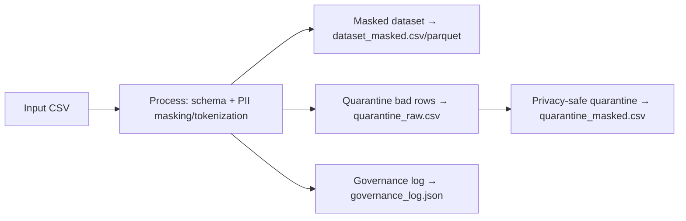

# Privacy Layer MVP

A tiny, local-first pipeline that enforces schema, masks/tokenizes PII, and quarantines bad rows.  
Great for demos and as a stepping stone to a universal privacy-aware wrapper.

---

## Quickstart

```bash
# 1) Create & activate a virtualenv (once)
python3 -m venv venv
source venv/bin/activate

# 2) Install deps
make install
```
---
## Build Badge


---

## Demo (happy path)

```bash
make demo
```

**Outputs → `out_demo/`**

- `dataset_masked.csv` – CSV with PII masked/tokenized  
- `dataset_masked.parquet` – Parquet copy  
- `governance_log.json` – log of actions, counts, and metadata  

Run an audit check:

```bash
python audit/verify.py out_demo
```

✅ Should PASS with 250 rows processed and no quarantines.

---

## Demo (bad input → quarantine)

```bash
make demo-bad
```

**Outputs → `out_demo_bad/`**

- `quarantine_raw.csv` – unmasked bad rows + reason  
- `quarantine_masked.csv` – privacy-safe copy of bad rows  
- `governance_log.json` – includes `quarantined_rows` + paths  

Example: rows with invalid date formats get dropped into quarantine with the reason annotated.

---

## Governance log

Every run writes a governance log JSON with metadata:

```json
{
  "policy": "fintech_default",
  "policy_version": "0.1.0",
  "input": "data/sample_transactions.csv",
  "output_csv": "out_demo/dataset_masked.csv",
  "output_parquet": "out_demo/dataset_masked.parquet",
  "totals": { "rows": 250, "actions": 1500 },
  "quarantined_rows": 0,
  "quarantine_path": "",
  "quarantine_masked_path": ""
}
```

---

## Policies

Policies live in `configs/` (e.g. `fintech_default.json`, `fintech.json`).  
They describe what fields to enforce, mask, tokenize, or quarantine.  

Example (simplified):

```json
{
  "fields": {
    "customer_email": "tokenize",
    "card_number": "mask_pan",
    "account_id": "tokenize"
  },
  "strict_mode": false
}
```

---

## Audit

You can sanity-check an output directory anytime:

```bash
python audit/verify.py out_demo
```

Checks include:

- Row counts match  
- No obvious emails or PANs leak through  
- Tokenized columns are consistent  

---

## Data Flow



---

## Next steps

- Add more sample policies under `configs/`  
- Extend schema + quarantine rules for your domain  
- Integrate into ETL/ML pipelines  
- Push logs into a governance backend  

---

## License

MIT — see [LICENSE](LICENSE).
