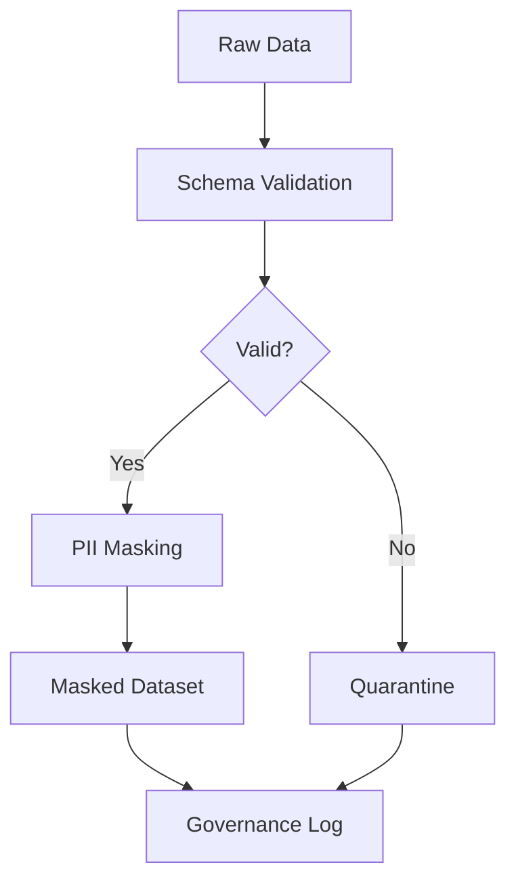

# Privacy Layer MVP  
*A tiny, local-first pipeline that enforces schema, masks PII, and quarantines bad rows. Great for demos and as a stepping stone to a universal privacy-aware wrapper.*  

[](https://github.com/justfrfun/privacy_layer_mvp/actions/workflows/ci.yml)

---

## 🌐 Overview  
This project demonstrates a lightweight, privacy-aware data pipeline. It is designed to be:  

- **Local-first** → Runs without relying on external services.  
- **Schema-enforcing** → Ensures datasets match expected structure.  
- **Privacy-aware** → Detects and masks Personally Identifiable Information (PII).  
- **Governance-ready** → Quarantines bad rows and logs masking/quarantine events.  

Think of this MVP as a **universal privacy wrapper prototype**: a foundation for more advanced governance, interoperability, and AI-readiness.  

---

## 🔄 Data Flow  



- **Raw Data** → Any CSV file.  
- **Schema Validation** → Ensures column structure matches expectations.  
- **PII Masking** → Sensitive fields are replaced with masked values.  
- **Quarantine** → Invalid rows are isolated for review.  
- **Governance Log** → Records all transformations for auditing.  

---

## 🚀 Features (current MVP)  

- ✅ CSV schema validation  
- ✅ PII masking (basic patterns)  
- ✅ Quarantine handling for invalid rows  
- ✅ Governance logging (JSON)  

---

## 📦 Installation  

```bash
git clone git@github.com:justfrfun/privacy_layer_mvp.git
cd privacy_layer_mvp
pip install -r requirements.txt
```

---

## ▶️ Usage  

Run the pipeline on a sample dataset:  

```bash
python run_pipeline.py --input data/sample.csv --output out/
```

Outputs will include:  

- **Masked dataset** → `out/dataset_masked.csv`  
- **Quarantine rows** → `out/quarantine.csv`  
- **Governance log** → `out/governance_log.json`  

---

## 🧪 Demo  

Want to try quickly? Use the provided demo script:  

```bash
python demo.py
```

This generates:  

- **Good outputs** under `out_demo/`  
- **Quarantined outputs** under `out_demo_bad/`  

---

## 📋 Roadmap  

- [ ] Add schema definitions to `schema.py`  
- [ ] Implement token vault (`vault.py`) for reversible pseudonymization  
- [ ] Expand input support (Parquet, JSON)  
- [ ] Add pluggable detection engines (e.g., Presidio)  
- [ ] Cloud + local storage interoperability  

---

## 📜 License  

MIT License.  
